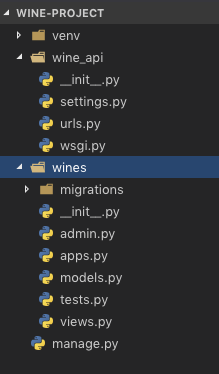

# wine_app: Using Django As An API

So far we've been using Django to create full stack web applications. This type of app, where both the front and back end are coupled together into a single code base can become a monolithic (i.e., huge) application. In some cases, it works, but as applications grow to hundreds of thousands of lines of code it can become a nightmare to debug and add new features.

Enter the concept of microservices and Service Oriented Architecture (SOA). This idea builds off of Single Responsibility code in that one app does one thing. In this, we create web applications that separate the front and back end. Moving forward, we'll use Django as an API to handle reading from / writing to the database and ReactJS to handle all of our front end logic (i.e., what the user sees / interacts with).

Today we're going to create a Django API that keeps track of different wines and returns JSON instead of HTML. If you remember from the Ticketmaster challenge, we got JSON back from Ticketmaster, not HTML. Using that JSON, we were then able to populate our frontend with the correct data.

## Release History
* 0.0.1
    * Work in progress

## Meta

Carole Ouedraogo
[https://github.com/Carole-Ouedraogo/github-link](https://github.com/Carole-Ouedraogo)

## Contributing

1. Fork it (<https://github.com/Carole-Ouedraogo/wine_app/fork>)
2. Create your feature branch (`git checkout -b feature/fooBar`)
3. Commit your changes (`git commit -am 'Add some fooBar'`)
4. Push to the branch (`git push origin feature/fooBar`)
5. Create a new Pull Request
